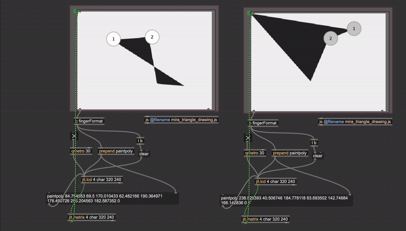
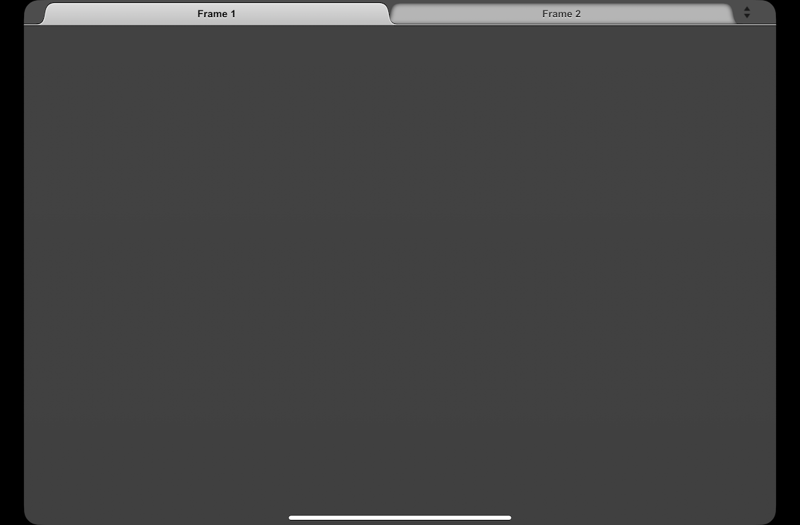
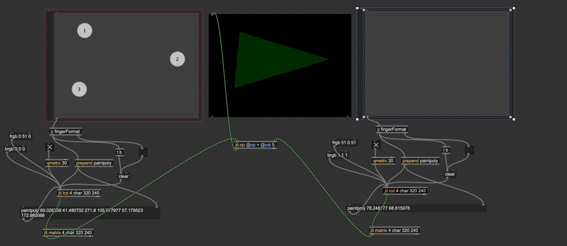
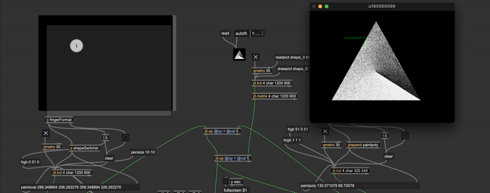
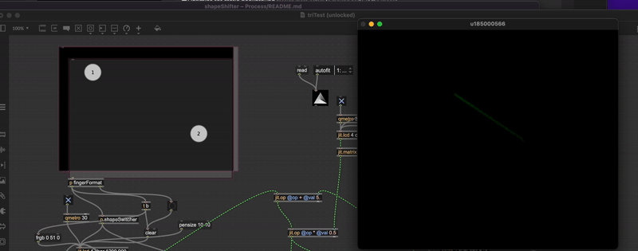

# Process Documentation

Digital Relic and Mouse & the Billionaire back at it again!

## Initial Brainstorming | 01.20.25

Question: how can we take some of the ideas from [LTHC](www.mouseandthebillionaire.com/lthc/) and create an experience that is:
- collaborative
- slightly more puzzly/playful
- still reflective/contemplative and musical

Ideas:
- two smaller controller boxes that are facing each other
- a transparent screen between the two players with shared information
- some sort of hidden information. Perhaps by the physical nature of the transparency of the shared screen, or on a secondary screen that only individual players have access to
- some shared goal that they are trying to achieve. There's something about holding something in place while the other player moves _their_ part. Two people screwing in a lightbulb.
- What if the individual screens in front of each player was a touch screen? And you have to manipulate and hold something on the screen while communicating with the other player?
- Tangrams: you make shapes with your fingers, and combining that shape with the other player's shape unlocks the goal. 
- Increasingly difficult challenges. Starting with one finger, then making lines with two fingers, then shapes with three fingers.
- The line challenges could be like Ice Cold Beer
- Is Max/MSP + MIRA a possible solution for the touchscreen interaction?

Next:
- Can you run two MIRA instances from two different iPads?
- Can the shapes you draw show up in a jit.pwindow in the MIRA frame?
- Can MIRA be fullscreen enough for it to be a seamless interface?
- We still want to use at least one rotary dial. What could that be used for? What if there are two?

## MIRA Tests | 01.21.25

The first question we run up against is the hardware feasibility of some of this. Is MIRA a good solution for getting multi-touch user input? Can you get two different iPads to contribute to the same Max patch? If so they could each control separate aspects of the visuals/sounds (or we can deal with some averaging/combining so that they both are needed to reduce noise, clear out the delay feedback, etc.)

It works! We are able to get user input on two separate iPads. Right now they are making shapes on separate lcd objects, so there will definitely be some finagling required to make them work seamlessly together, but it is definitely possible. There are some issues that crop up though...

- MIRA doesn't display the lcd (or any visual) object, so there is no way to update the visuals on the actual iPad. This is probably fine, and the players would just need to look at the shared screen to see what they are doing. This does raise the possibility for _different_ hidden information to be visible on the individual screens. This could be messages, shapes, colors, etc. Ideation later to think about this.
- In the current implementation there is no dynamic ability to change the number of finger inputs (it's always looking for 4) which isn't ideal.
- Note: Right now we are using the WiFi connection for MIRA/iPad, but it is also possible to be wired, which could come in handy?
- Though Mira has an option for "kiosk mode" there is no way to hide the tabs within the app. This will need to be taken into account when designing the device. We will need a smaller window to hide this physically.

Next:
- What could the hidden information on the screen be? It would have to use MIRA-compatible objects, but this is probably a good constraint to be working in.
- Make the touchpoint options variable so the players can create dots, lines, triangles, polygons, and pentagons
- Test out the feasibility of both MIRA instances painting on the same canvas. Or on overlapping canvasses?

## MIRA Tests Stage 2 | 01.23.25

Mocked up a fairly simple test to see how feasible this is going to be moving forward. We need to switch away from the LCD object and use jit.op to combine the two inputs, which sets up the possibility of some really interesting combinations. The addition operator is the most obvious choice here, but what might this look like with all of the other operators (-/*!&&). If we decide to move forward this setup, it would be beneficial to record a few videos of the shapes being made, to test these different operators (quite hard to make shapes with both hands while selecting through the operator options!)

Thoughts:
- What is the best way to know when the user(s) have put their fingers in thr right locations? Should we calculate the distance between a given location and the nearest finger? Seems a little overcomplicated. We had discussed using the button object. Is that a cheap and fast solution? Can you make them invisible? 
- If this is the case, how would we switch between those grid locations (i.e you solved this shape, here's the next one)
- Similarly, how can we communicate the shapes to be made? If we add a third canvas that is the desired shape, does this break the jit.op combination? I don't believe it does, but worth testing.

Next:
- Test a version with invisible buttons
- Can we use a message box to load new button locations to the mira.frame objects?

## MIRA Tests Stage 3 | 01.28.25

The buttons did not work because Max buttons don't have any indicator for release (or hold). So instead this version uses a javascript object that takes the inputs and determines what type of shape should be drawn. Additionally, another javascript object takes those three inputs and determines how close they are to three target locations. Those target locations are hard-coded into the javascript, but we could write a version that takes the target locations as inputs. Not sure what would be the most efficient/easy/helpful way to do this (for game progression) but we have some options.

Thoughts:
- As shown in the gif, the switching between shapes is a bit buggy. The javascript should probably reset more frequently? And then look for fingers that are down (status: 2) But maybe the glitchyness is charming? 
- Similarly, the way that MIRA works a raised finger doesn't reset the fingers currently pressed down, so we can't easily go from poly to line, etc. Could rewrite the javascript to address this, but maybe it isn't worth it at this stage
- What would this look like without the touchscreen (if we wanted to make this in Unity instead)? Could the dials control XY locations of the dots on screen (with press) activating certain nodes? Could there be a master dial that selects which node you are controlling? Something to think about.
- Explored using the * operator for jit.op (below) and there are some fun visual puzzle opportunities that arise.

## Meeting Notes | 02.03.25

### Thoughts:
- Could the button set shape and start new one. That way one user could be in charge of multiple shapes. Possibly too cumbersome, but something to try
- What if the whole thing was timed? You have to make these little shapes within a specefic time-frame for some reason
- Could you set the shapes and then use the knob to move shapes? Like a wizard who conjurs shaped and then relocates them on screen
- Trackball (Severance as precedent)
- Could the physical input devices be used for zooming? panning? 
- Using the jit op multiplication you could have the users uncover a more complex image.uncover image. Think about the tangrams more like a hitbox then the actual shape. However, the shape stuff is pretty great, so maybe it's fine to just stick with that
- Musically we could be using the built-in MIRA regions to have notes be played based on finger location. Could be an easy way to build in some musical elements to the play

### Next:
- Fix the persistent shapes when lifting / order of placement is erasing them
- Explore integrating jitter effects?
- Start building out the sonic aspects based on the MIRA regions
- Build the structure for switching when the proper shape has been made
- Why is the color changing every time the user places their fingers down? Weird bug